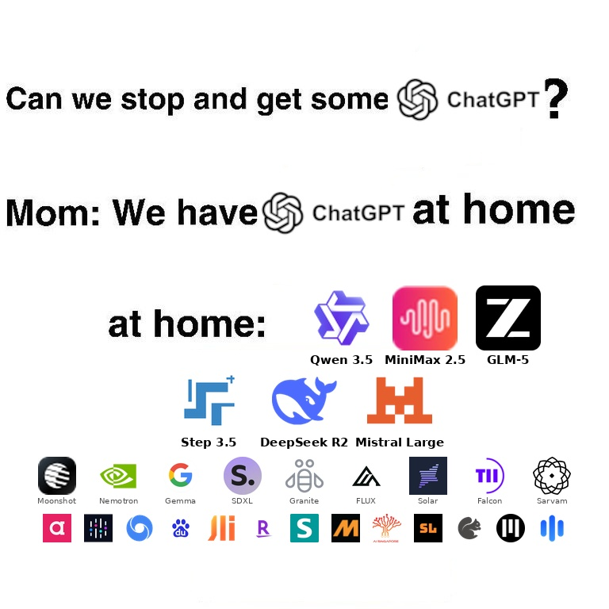

# ChatGPT at Home

<p align="center">
  
</p>

Your own ChatGPT — for free. No API costs, no subscriptions, no catch.

A single-container deployment of [Open WebUI](https://github.com/open-webui/open-webui) + [Open Terminal](https://github.com/open-webui/open-terminal), pre-configured with 100+ free AI models via [NVIDIA NIM](https://build.nvidia.com).

[](https://railway.com/deploy/free-open-webui-terminal)

## Quick Start

### One-Click Deploy (Railway)

1. Click the **Deploy on Railway** button above
2. Get a free API key from [NVIDIA NIM](https://build.nvidia.com/settings/api-keys) (no credit card needed)
3. Set `NVIDIA_NIM_API_KEY` to your key
4. Set `WEBUI_ADMIN_EMAIL` and `WEBUI_ADMIN_PASSWORD` to your desired login credentials
5. Deploy, open the generated URL, and sign in

### Run Locally (Docker)

```bash
cp .env.example .env
# Edit .env with your NVIDIA_NIM_API_KEY and login credentials
docker build -t chatgpt-at-home .
docker run -d -p 3000:8080 --env-file .env chatgpt-at-home
```

Open http://localhost:3000 and sign in with your credentials.

## Environment Variables

| Variable | Required | Description |
|---|---|---|
| `NVIDIA_NIM_API_KEY` | Yes | Free API key from [NVIDIA NIM](https://build.nvidia.com/settings/api-keys) |
| `WEBUI_ADMIN_EMAIL` | Yes | Admin login email |
| `WEBUI_ADMIN_PASSWORD` | Yes | Admin login password |

## License

This project combines [Open WebUI](https://github.com/open-webui/open-webui) (MIT) and [Open Terminal](https://github.com/open-webui/open-terminal) (MIT).
